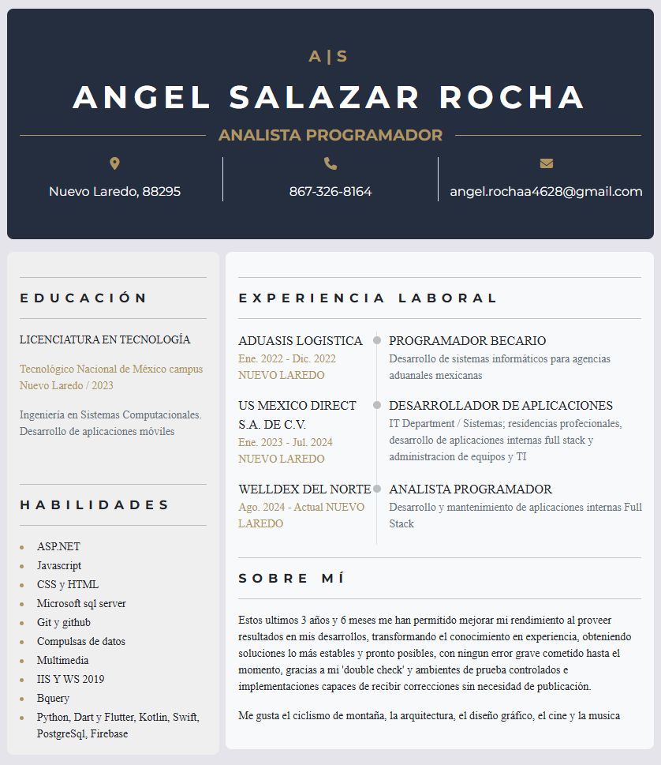

VistaPrevia

  

(Para vista dinamica, descargue el repositorio y abra el archivo cv.html)

# A|S  
## ANGEL SALAZAR ROCHA  

# A|S
## ANGEL SALAZAR ROCHA  

---

### ANALISTA PROGRAMADOR  

📍 Nuevo Laredo, 88295  
📞 867-326-8164  
📧 angel.rochaa4628@gmail.com  

---

## EDUCACIÓN  

**LICENCIATURA EN TECNOLOGÍA**  
*Tecnológico Nacional de México campus Nuevo Laredo / 2023*  
Ingeniería en Sistemas Computacionales. Desarrollo de aplicaciones móviles  

---

## HABILIDADES  

- ASP.NET  
- Javascript  
- CSS y HTML  
- Microsoft SQL Server  
- Git y GitHub  
- Compulsas de datos  
- Multimedia  
- IIS y WS 2019  
- Bquery  
- Python, Dart y Flutter, Kotlin, Swift, PostgreSQL, Firebase  

---

## EXPERIENCIA LABORAL  

### ADUASIS LOGISTICA  
**PROGRAMADOR BECARIO**  
📅 Ene. 2022 - Dic. 2022 | 📍 NUEVO LAREDO  
Desarrollo de sistemas informáticos para agencias aduanales mexicanas  

### US MEXICO DIRECT S.A. DE C.V.  
**DESARROLLADOR DE APLICACIONES**  
📅 Ene. 2023 - Jul. 2024 | 📍 NUEVO LAREDO  
IT Department / Sistemas; residencias profesionales, desarrollo de aplicaciones internas full stack y administración de equipos y TI  

### WELLDEX DEL NORTE  
**ANALISTA PROGRAMADOR**  
📅 Ago. 2024 - Actual | 📍 NUEVO LAREDO  
Desarrollo y mantenimiento de aplicaciones internas Full Stack  

---

## SOBRE MÍ  

Estos últimos 3 años y 6 meses me han permitido mejorar mi rendimiento al proveer resultados en mis desarrollos, transformando el conocimiento en experiencia, obteniendo soluciones lo más estables y prontas posibles, sin errores graves cometidos hasta el momento, gracias a mi *double check* y ambientes de prueba controlados, así como implementaciones capaces de recibir correcciones sin necesidad de publicación.  

Me gusta el ciclismo de montaña, la arquitectura, el diseño gráfico, el cine y la música.  
